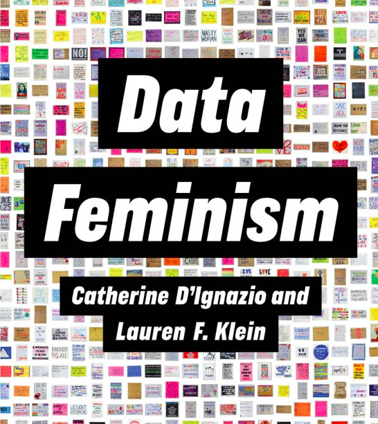

Write stuff in Markdown here. Like **bold** things and *italic* things. 

And images:

```{r, echo = FALSE, out.width = '50%'}

```

And don't forget about R code:

```{r}
knitr::kable(mtcars)
```

