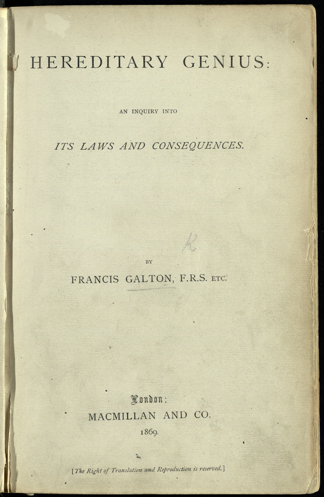

The introduction to *Data Feminism* ^[https://data-feminism.mitpress.mit.edu/pub/frfa9szd/release/4] makes it clear that data science is an effective tool which can be used to manipulate power dynamics in our society. It presents the case of Christine Darden as an example of data being used to promote equality in the workplace, helping to break down unjust gender, race, and administrative power dynamics. It also mentions that data interpretation has been used to bolster the eugenics movement and predictive policing. With this array of applications, D'Ignazio and Klein aptly refer to data as a “double-edged sword”. 

```{r echo=FALSE, out.width= "25%", out.extra='style="float:right; padding:10px"'}

```

Upon reading the article *How Eugenics Shaped Statistics* by Aubrey Clayton^[https://nautil.us/issue/92/frontiers/how-eugenics-shaped-statistics], I was reminded of another potent example of this double-edged sword that I learned about in a neuroscience class. The article by Clayton details the racist beliefs of Francis Galton, both the “father of eugenics” and a “statistical pioneer”. It says how, in his 1869 book *Hereditary Genius*, Galton assessed that “the average intellectual standard of the Negro race is some two grades below our own.” Here we see an early example of using mathematical language (“average”, “standard”, “two grades”) to justify racism and genocide. 

```{r echo=FALSE, out.width= "25%", out.extra='style="float:left; padding:10px"'}

```

Galton’s views are widely criticized today, yet some of the core ideas of this biological racism live on in real, impactful ways. A recent article in the New York Times^[https://www.nytimes.com/2020/08/25/sports/football/nfl-concussion-racial-bias.html] describes racial bias in concussion payouts for black former NFL players, the justification of which is rooted in data analysis and medical racism. Essentially, when determining eligibility for dementia claims due to injuries sustained during their careers, former NFL players are administered a cognitive exam and given a score. If this score falls below a certain benchmark score, they qualify for the payout and receive compensation. However, this benchmark score is not the same for everyone. It is adjusted for demographics, such as age, education, and race. According to the NFL and the scientists behind this methodology, this is to prevent misdiagnosis, and is justified using statistical technique to create “improved, demographically-corrected normative standards… to provide a more accurate classification of neuropsychological performance.”^[https://www.ncbi.nlm.nih.gov/pmc/articles/PMC3154384/] However, in practice, the benchmark score is lower for black people than it is for white people. This means that black players must show more severe cognitive decline than white players in order to qualify for a payout, since the benchmark level of cognition for black people was determined to be lower. This is eerily similar to Galton’s claims concerning the “average intellectual standard” of black people. The NYT article tells the story of two black former players who qualified for the payout without accounting for their race, but then were denied once their race was taken into consideration. 

```{r echo=FALSE, out.width= "25%", out.extra='style="float:right; padding:10px"'}

```

In this case, we see that data analysis has been used to deny access to compensation on the basis of race. The article also mentions that “It is unclear what percentage of Black players have had their dementia claims denied compared to white ex-players because the settlement administrator does not publish data on the race of applicants.” If made available, this data could be used to show systematic discrimination in payout receival, in a similar manner to Darden’s analysis. Here we have an interesting case in which data analysis could be used both to create, and potentially combat, discriminatory practices. 

<font size = "1">

Image sources

* Sword: https://usadultliteracy.com/2013/05/15/idiom-of-the-week-double-edged-sword/
* Hereditary Genius: https://www.bl.uk/collection-items/hereditary-genius-a-19th-century-theoretical-basis-for-eugenics
* Helmet: https://www.nicepng.com/ourpic/u2q8i1t4u2r5y3w7_blank-football-helmet-clipart-kid-football-helmet-clipart/

</font>

