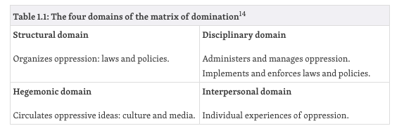

Chapter 1 of *Data Feminism*^[https://data-feminism.mitpress.mit.edu/pub/vi8obxh7/release/3] explores themes of power and privilege, and how they play a role in the culture and products produced by data scientists. In understanding power structures, I found the breakdown of the “matrix of domination” particularly helpful (see Table 1.1 from *Data Feminism*). 

```{r echo=FALSE, out.width= "75%", out.extra='style="float:right; padding:5px"'}

```

These 4 domains: structural, disciplinary, hegemonic, and interpersonal -- can act as a sort of checklist for changemaking. In her work with the Algorithmic Justice League, Joy Buolamwini has demonstrated a methodical and effective approach for working against algorithmic bias by impacting each of these domains. Each domain requires attention and improvement, however I think the hegemonic and interpersonal domains are unique in that they present many more gray areas in terms of solutions. In the structural and disciplinary domains, one can begin advocacy by pointing to a racist law or a sexist policy and saying, “this needs to change”, offering a clear target for our efforts. The same cannot usually be said for larger ideas of societal culture, or for something as subjective as individual experiences. 

One issue in the interpersonal domain discussed in Chapter 1 was the idea of “OPP”, other people’s problems. This is the idea that race is only something that people of color have to think about, class is only something poor people have to think about, and gender is only something women and nonbinary people have to think about (and more). This is a common narrative, perpetuated by the fact that most of the advocates for these issues belong to minoritized groups. But the reality is that those in positions of power have historically, and continue to, uphold systems that oppress the minoritized groups. Change cannot occur without these “majority” groups actively working to break down unfair systems of privilege and power. 

So how can we work toward data science teams that are aware of structural oppression, and view their work through this critical lens? How can we also ensure that the work environment for the data scientists themselves is inclusive and equitable? These are big questions that have different complex solutions for different situations. One sentence from *Data Feminism* helped me frame a potential answer: “If the 79 percent of engineers at Google who are male were specifically trained in structural oppression before building their data systems (as social workers are before they undertake social work)—then their overrepresentation might be very slightly less of a problem.” 

So, the solution is *at least* two-fold: we must increase the number of people with minoritized identities working on data science teams, and also train the entire team in data feminism and structural oppression. But, as we have seen recently in publicized debates involving Smith, these trainings are not without opposition. I think part of this opposition comes from the transition from these ideas being other people’s problems (OPP) to suddenly being *your* problem. This can be a jarring realization, which can unfortunately sometimes manifest in feelings of guilt, disbelief, and/or resentment. The people most likely to feel this way (those in privileged groups) are also those that can learn the most from such trainings. So, these trainings must be designed carefully, with the target audience in mind. This is because the most lasting change will come when the privileged and the under-privledged share a common vision.  

<font size = "1">

Image sources

* Table 1.1, the matrix of domination: https://data-feminism.mitpress.mit.edu/pub/vi8obxh7/release/3


</font>

