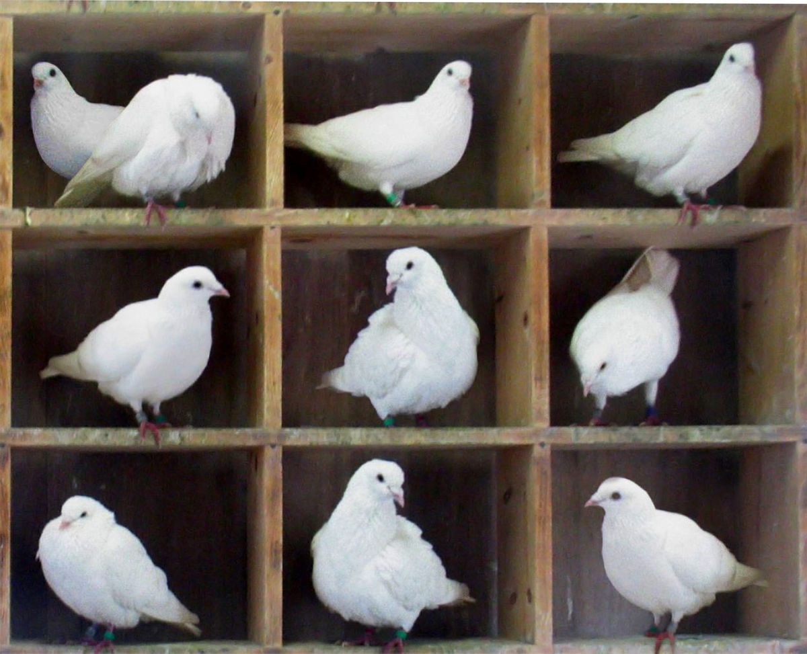

```{r echo=FALSE, out.width= "25%", out.extra='style="float:right; padding:5px"'}

```

A couple of stories mentioned in this chapter led me to think deeper about my potential future role as a data scientist. One was that of Julia Angwin, the data journalist that audited the Equivant recidivism risk algorithm. The chapter mentions that in addition to promoting racial discrimination in recidivism risk, the algorithm also negatively impacted females. A “high risk” score for a woman was found to be equivalent to a “medium risk” score for a man. But, women with high risk scores were being judged as if they were as likely to return to jail as a high risk man, which is not the case. Angwin decided to make the focus of the Equivant audit story about racial discrepancies rather than about gender, in part because of sexism that she had experienced as a female data journalist. Up until that point, she had been hesitant to work on stories concerning gender disparities because she did not want to become pigeonholed as a female data journalist who only works on projects about gender issues. Here, we see a case of internalized sexism that has real consequences -- fewer women willing to advocate for gender equality in their professions. 

Prior to reading this, I had never really considered the possibility of being pigeonholed at work. At least, not in a negative way. I tend to think that creating some sort of theme to your professional ventures is a positive. It can create a narrative, something to tie all of your work together, and some area to build expertise in. However, the issue is when that niche is expected of you simply because of your social identities. And, once one does what is expected of them, it can make it much more difficult to do anything else. As a female graduate of a historically women’s college, I can easily see this gender pigeonhole being applied to me in the workplace. For me, at this early point in my career, I take little issue with that assumption because I am happy to work on the important issues of social justice and gender equity, and I don’t mind making it a part of my “brand”. However, as I progress in my career I will take care to be aware of the threat of pigeonholing and try to avoid falling into a restrictive position professionally. 

*Fun fact: The term “pigeonhole” comes from the man-made compartments that racing pigeons were nested in. It was then used to refer to the arrangement of compartments in offices used to sort and file documents, due to their resemblance to the pigeon nests. The term then evolved to mean generally sorting or classifying information, which is similar to its modern-day meaning of restrictively classifying people.*^[https://en.wikipedia.org/wiki/Pigeon-hole_messagebox#]


<font size = "1">

Image sources

* Pigeons: https://en.wikipedia.org/wiki/Pigeonhole_principle


</font>
